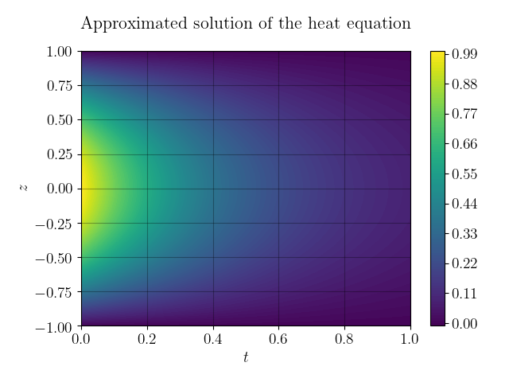
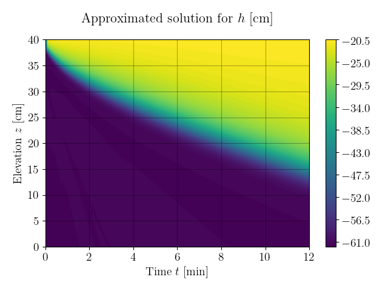

# Approximator

A tool to use neural networks to approximate arbitrary functions (currently ) by specifying a domain and one or multiple residuals for (parts of) the domain.
Can be used especially for the approximation of solutions of partial differential equations.
Based on [PyTorch](https://github.com/pytorch/pytorch).

## Examples (in `examples`)
### Sinus
Approximate an explicitly given function.

### Circle
Approximate a piecewise given function.

### Conservation
Approximate the solution of an initial-boundary value problem governed by the conservation equation by using its residual.

### Laplace
Approximate a solution of an initial-boundary value problem governed by Laplace's equation:  

Uses `StepsDiscretization` to ensure that start and endpoints of domain are in the discretized domain, this is important for boundary conditions.
Pretraining is used to first fit the neural network to the boundary conditions, then to the PDE.

### Heat
Approximate the heat equation:

### Richardson-Richards equation
Approximate the Richardson-Richards equation in the setup [described by Michael A. Celia, Efthimios T. Bouloutas and Rebecca L. Zarba in 1990](https://doi.org/10.1029/WR026i007p01483).

The RRE:  
  
with constitutive equation:  

